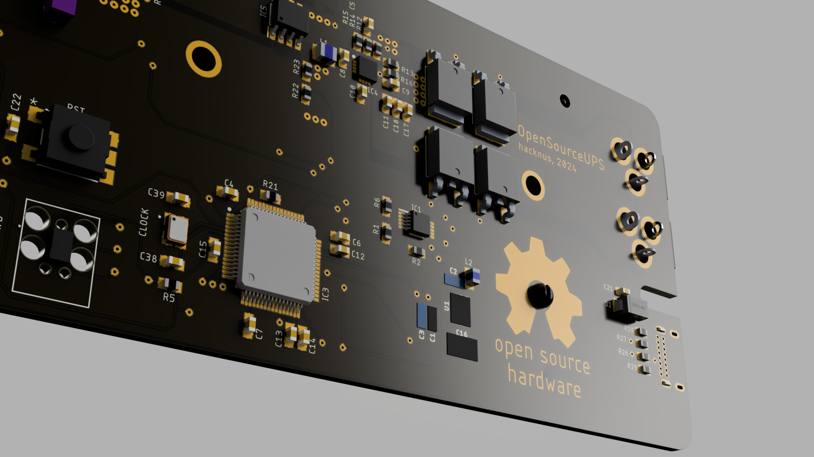
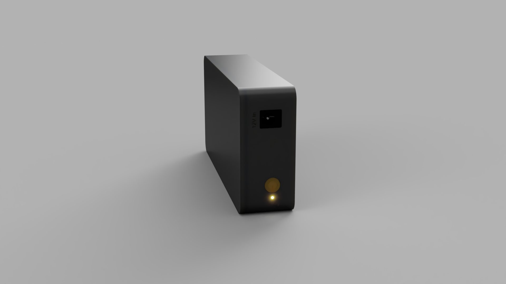
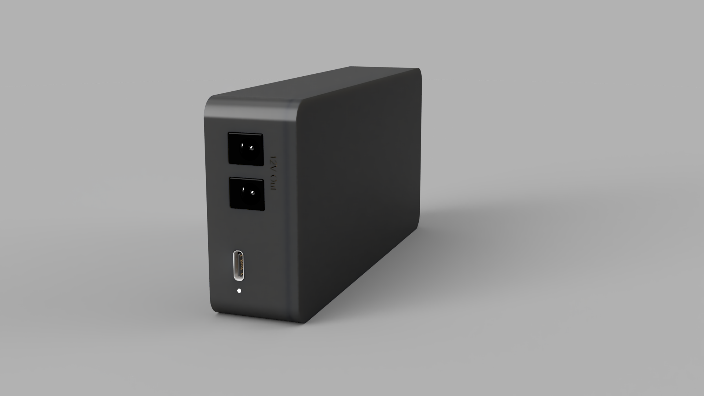
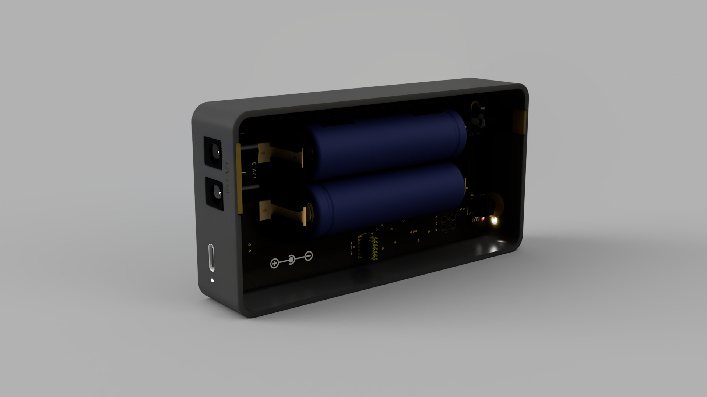
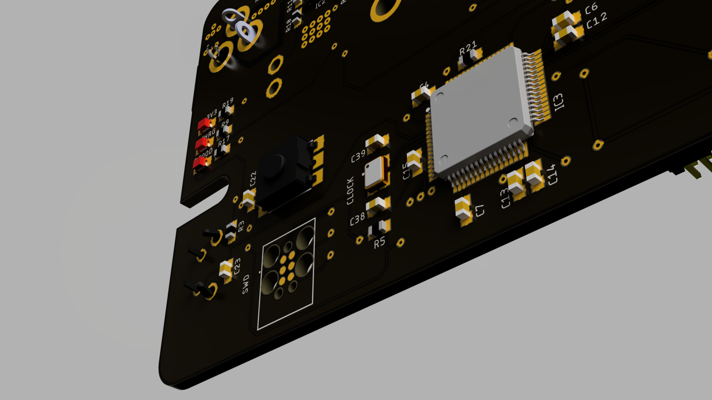

# Open Source UPS


UPS are commonly used in server applications to protect against power outages. For home applications, for example to protect a NAS, small Uninterruptible Power Supplies (UPS) do exist, but they all lack the USB HID communication to shut down the NAS/Server/Host when the battery gets low.
For small scale applications like Synology NAS products that operate at 12V, there currently exists no UPS product that is able to buffer the power and communicate over USB when the battery level gets critically low.
Only high voltage solutions (110V or 230V) exist, which also include an inverter and are thus much less efficient and overpowered for a simple 12V Synology NAS.
This is a simple, open source UPS, based around an STM32F405 and written in Rust.





The USB HID communication is based on the great work done by [abratchik](https://github.com/abratchik) for the Arduino platform [here](https://github.com/abratchik/HIDPowerDevice/tree/master). 
The hardware is essentially just a charging circuit where the remaining capacity is monitored by the MCU.



## Hardware
The hardware can be found in the [hardware folder](hardware), containing step files for the case as well as EAGLE files for the PCB.

## Flashing the firmware
Connect the board using a ST-Link V3 (with TagConnect) to a USB port on the computer. Be sure to power the board with an
additional USB-C connector. (ST-Link does not provide power)  
First start the openocd server in a terminal/console window:
```openocd -f interface/stlink-v2-1.cfg -f target/stm32f4x.cfg```   
Flash/Run the code on the hardware using:  
```cargo run --release```  
note: release is important for USB to work reliably!

To set up your system, be sure to
follow [this guide](https://docs.rust-embedded.org/discovery/f3discovery/03-setup/index.html)!